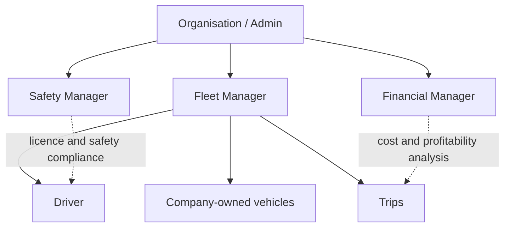
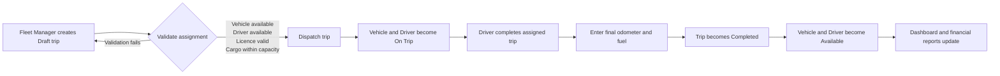

# TransitOps Architecture

## 1. Purpose

TransitOps is a role-based platform for an organisation to operate its own fleet: register vehicles and drivers, dispatch trips, control maintenance, record costs, and see operational reports.

## 2. Organisation and users



Vehicles belong to the organisation. A driver does not own a vehicle; the Fleet Manager assigns an available company vehicle to that driver for an individual trip.

| Role | Responsibilities | Not allowed to do |
| --- | --- | --- |
| Organisation Admin | Manage organisation account, users, roles, and global settings | Dispatch trips unless also given Fleet Manager access |
| Fleet Manager | Manage vehicles/drivers, create and dispatch trips, manage maintenance | Override licence or safety compliance result |
| Safety Manager | Verify licence, track expiry, safety score, and suspension status | Assign trips or edit financial records |
| Financial Manager | Record/review fuel and expenses, review cost, ROI, and exports | Assign drivers or change safety status |
| Driver | View assigned trips, start/complete own trip, enter final odometer and fuel data | Create a trip or choose a vehicle/driver |

## 3. Main modules

1. **Authentication and RBAC** - email/password login and access based on user role.
2. **Dashboard** - KPIs, alerts, recent trips, fleet status, and filters.
3. **Vehicle Management** - vehicle master data and availability status.
4. **Driver Management** - driver profile, licence data, safety score, and duty status.
5. **Trip Management** - trip draft, validation, dispatch, completion, and cancellation.
6. **Maintenance** - service/repair records that control vehicle availability.
7. **Fuel and Expense Management** - fuel, toll, repair, and other operational costs.
8. **Reports and Analytics** - utilisation, fuel efficiency, costs, profit/ROI, and CSV export.

## 4. End-to-end trip workflow



### Dispatch validation rules

- Vehicle registration number must be unique.
- Vehicle must be `Available`; `In Shop` and `Retired` vehicles never appear in dispatch selection.
- Driver must be `Available`, not suspended, and hold a non-expired verified licence.
- A vehicle or driver already `On Trip` cannot be assigned to another trip.
- Cargo weight must not exceed the vehicle maximum capacity.

The server must perform these checks and update the trip, vehicle, and driver in one database transaction. Frontend validation improves user experience but must not be the only protection.

## 5. Status model

### Vehicle

```text
Available -> On Trip -> Available        (dispatch then completion/cancellation)
Available -> In Shop -> Available        (open then close maintenance)
Available/In Shop -> Retired             (admin lifecycle action)
```

### Driver

```text
Available -> On Trip -> Available
Available <-> Off Duty
Available/Off Duty -> Suspended          (Safety Manager)
```

### Trip

```text
Draft -> Dispatched -> Completed
                 \-> Cancelled
```

## 6. Maintenance workflow

1. Fleet Manager opens a maintenance log for a vehicle.
2. System changes the vehicle status to `In Shop` immediately.
3. The vehicle is excluded from new trip assignments.
4. On closing maintenance, the vehicle returns to `Available`, unless it is `Retired`.
5. Maintenance cost becomes part of that vehicle's operational cost.

## 7. Licence verification with DigiLocker